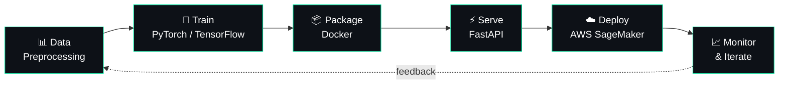

<div align="center">


<a href="https://git.io/typing-svg">
  
</a>

<br/>

[](https://www.linkedin.com/in/hasanali09)
[](https://www.kaggle.com/hassanali09)
[](https://leetcode.com/u/hassanaly_09/)
[](mailto:hassanali93r@gmail.com)

</div>

---

## 🧾 Model Card: `hassan-ali`

> Most people write a README. I wrote a model card, because that's how I think about everything: inputs, outputs, and what happens in production.

| | |
|---|---|
| **Model name** | Hassan Ali |
| **Task** | End-to-end ML: from trained model to reliable production service |
| **Architecture** | Deep Neural Networks · NLP · Computer Vision |
| **Frameworks** | PyTorch · TensorFlow · OpenCV |
| **Serving stack** | FastAPI → Docker → AWS SageMaker |
| **Currently fine-tuning** | MLOps · Kubernetes · Advanced Deep Learning |
| **Open to** | Collaboration on AI/ML projects, model deployment, open-source MLOps tools |

**✅ Intended use:** Ask me about MLOps, FastAPI, AWS SageMaker, Docker, data preprocessing, deep neural networks, and NLP.

**⚠️ Known limitations:** Will steer any conversation toward deployment. Believes a model that only lives in a notebook is a draft, not a product.

---

## 🛤️ My Pipeline

The way I like to ship: every stage automated, every stage observable.



---

## 🎯 Current Runs

```yaml
status: training
now:
  building:  End-to-End ML Deployment Pipelines with FastAPI & AWS SageMaker
  learning:  [MLOps, Kubernetes, Advanced Deep Learning (PyTorch & TensorFlow)]
  seeking:   [AI/ML Projects, Model Deployment, Open Source MLOps Tools]
philosophy: "Ship it, monitor it, improve it."
```

---

## 🧰 Tech Stack

**🧠 ML & AI**


**🚀 Deployment & Infrastructure**


**💻 Software & Web**


**⚙️ Systems**


---

## 📊 Metrics

<div align="center">


</div>

<!--
  ⭐ OPTIONAL: featured projects. Uncomment and swap in your real repo names.

<div align="center">

<a href="https://github.com/hasanaly09/YOUR-REPO-1">
  
</a>
<a href="https://github.com/hasanaly09/YOUR-REPO-2">
  
</a>

</div>
-->

---

## 📈 Contribution Graph

<div align="center">


</div>

---

<div align="center">

```bash
$ curl -X POST https://hassan.ai/collaborate -d '{"idea": "your next ML project"}'
# → 200 OK. Let's build and deploy it. 🚀
```


</div>
